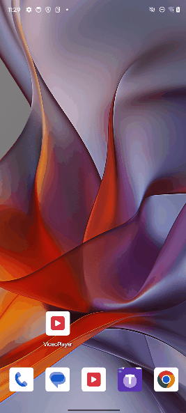

# info
A android camera2 based on Camera2API/OpenCV/OpenGL/Neon/OpenCL

Features
- capture photo/recording video
- zsl capture photo
- capture hdr by opencv
- 1:1, 4:3, 16:9, full preview size
- aid grid line: diagonal, cross hairs, golden mean, golden spiral
